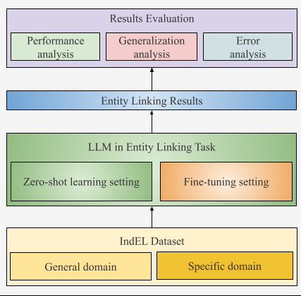

# ELMEval: a framework to evaluate large language models (LLMs) in Entity Linking (EL) tasks for Low-resource Languages (LrLs), specifically in Indonesian
**Ria Hari Gusmita, Asep Fajar Firmansyah, Hamada Zahera, Axel-Cyrille Ngonga Ngomo**

## Introduction
We present ELMEval, a framework designed to evaluate LLMs in EL tasks for LrLs, assessing their effectiveness in data annotation. By doing so, we aim to suggest a cost-effective solution for creating or expanding EL benchmark datasets for LrLs. We use IndEL to perform evaluations in both zero-shot and fine-tuning settings with multilingual and Indonesian monolingual LLMs. The multilingual LLMs include [GPT-3.5](https://platform.openai.com/docs/models/gpt-4-turbo-and-gpt-4), [GPT-4](https://platform.openai.com/docs/models/gpt-4-turbo-and-gpt-4), and [LLaMA-3](https://huggingface.co/meta-llama/Meta-Llama-3-8B-Instruct), while the monolingual Indonesian LLMs include [Komodo](https://huggingface.co/Yellow-AI-NLP/komodo-7b-base) and [Merak](https://huggingface.co/Ichsan2895/Merak-7B-v4-GGUF).

## ELMEVal Architecture

<p align="center">

</p>

## IndEL
IndEL is the first Indonesian EL benchmark dataset, covering both general and specific domains. It uses Wikidata as the knowledge base and is manually annotated following meticulous guidelines. The entities in the general domain are sourced from the Indonesian NER benchmark dataset, [NER UI](https://github.com/indolem/indolem/tree/main/ner/data/nerui), while those in the specific domain are gathered from [IndQNER](https://github.com/dice-group/IndQNER/tree/main/datasets), an Indonesian NER benchmark dataset based on the Indonesian translation of the Quran. IndEL has been utilized to evaluate five multilingual EL systems, including [Babelfy](http://babelfy.org/), [DBpedia Spotlight](https://www.dbpedia-spotlight.org/), [MAG](https://github.com/dice-group/AGDISTIS), [OpenTapioca](https://github.com/opentapioca/opentapioca), and [WAT](https://sobigdata.d4science.org/web/tagme/wat-api) using [the GERBIL framework](https://gerbil.aksw.org/gerbil/) platform. Details on the dataset as well as experiment results can be seen [here](https://github.com/dice-group/IndEL). 

## Evaluation Process

Similar to human-based annotation, where annotation guidelines ensure standard and correct results, we define relevant prompts for the LLMs. These prompts comprise two parts: task description and desired outputs, as shown below.

<table>
  <tr>
    <th colspan="2" style="text-align:center">Instruction Template</th>
  </tr>
  <tr>
    <td><strong>Task Description</strong></td>
    <td>Find entities and their corresponding entry links in Wikidata within the following sentence. Use the context of the sentence to determine the correct entries in Wikidata.</td>
  </tr>
  <tr>
    <td><strong>Output Format</strong></td>
    <td>The output should be formatted as: [entity1=link1, entity2=link2]. No explanations are needed.</td>
  </tr>
  <tr>
    <td><strong>Sample Sentence</strong></td>
    <td><i>Pria kelahiran Bogor, 16 Maret 60 tahun silam itu juga ditunjuk sebagai salah satu direktur Indofood dalam RUPS Juni 2008 silam.</i> (A man born in Bogor, 60 years ago on March 16, was also appointed as one of the directors of Indofood in the General Meeting of Shareholders in June 2008.)</td>
  </tr>
</table>

In the zero-shot setting, we prompt the LLMs using an instruction format, where the prompt includes only the task description and output format. Meanwhile, in the fine-tuning setting, the LLMs are provided with detailed prompts and example sentences from the dataset. To support the zero-shot and fine-tuning experiments, we split IndEL into training, validation, and test sets using an 8:1:1 ratio. The following are the details of the split:

| Domain          | Total Sentences | Train | Validation | Test |
|-----------------|-----------------|-------|------------|------|
| General Domain  | 2114            | 1673  | 229        | 212  |
| Specific Domain | 2621            | 2075  | 283        | 263  |


### Steps in Zero-shot Experiment
#### GPT-4
1. **Model:** GPT-4 
2. **Datasets preparation:** Consider to update the domain manually on ```preparing_dataset.py```
```
domain = "general-domain" # change to 'specific-domain' if you want to generate test dataset for specific domain and vice-versa
```
```
cd scripts/gpt
python preparing_dataset.py
```
3. **Execute zero-shot-based prediction**
```
cd scripts/gpt
python run_predictions.py
```

#### LLaMA Family
1. **Model:** Komodo-7b-base, Llama-3-8B-Instruct, Merak-7B-v4
2. **Datasets preparation**
   The datasets are available in datasets directory 
4. **Execute zero-shot-based prediction**
The value of ```domain``` and ```base_model_name``` are subject to change.
```
cd scripts/llama
python run_predictions.py
```

### Steps in Fine-tuning Experiment
1. **Datasets preparation:** To prepare the datasets for training the GPT model, refer to step 2 in the LLaMA Family section. Consider the path of the source dataset, the domain, and the name of the file where the processed data will be stored.
2. **Fine-tuning process**
- **GPT-3.5** We use GPT-3.5 to fine-tune the model due to its availability. To perform this process, you can follow the procedure on [OpenAI's fine-tuning platform](https://platform.openai.com/finetune). In this experiment, we set the hyperparameters as follows: number of epochs = 3, batch size = 8, and learning rate multiplier = 2.
- **Llama Family**
The value of ```domain``` and ```base_model_name``` are subject to change.
```
cd scripts/llama
python llm-finetuning.py
```

## Evaluation Results
We evaluate four LLMs, GPT-4, Komodo, LLaMA-3, and Merak in the EL task using the IndEL dataset in the zero-shot setting. Additionally, we evaluate GPT-3.5 (we did not have access to fine-tune GPT-4), Komodo, LLaMA-3, and Merak in the fine-tuning setting. The followings are the results measured in precision, recall, and F1-score.
|Metrics         |GPT-4 |Komodo|LLaMA-3|Merak |
|----------------|------|------|-------|------|
|General Domain with Zero-shot  	      |	
|Precision       |0.083 |0.000 |0.003  |0.000 |
|Recall          |0.089 |0.000 |0.003  |0.000 |
|F1              |0.083 |0.000 |0.003  |0.000 |
|Specific Domain with Zero-shot               |	
|Precision       |0.010 |0.000 |0.000  |0.000 |
|Recall          |0.016 |0.000 |0.000  |0.000 |
|F1              |0.012 |0.000 |0.000  |0.000 |

|Metrics         |GPT-3.5|Komodo|LLaMA-3|Merak |
|----------------|-------|------|-------|------|
|General Domain with Fine-tuning               |	
|Precision       |0.385  |0.018 |0.084  |0.045 |
|Recall          |0.373  |0.026 |0.117  |0.039 |
|F1              |0.373  |0.021 |0.093  |0.041 |
|Specific Domain with Fine-tuning              |
|Precision       |0.616  |0.221 |0.415  |0.446 |
|Recall          |0.610  |0.471 |0.444  |0.393 |
|F1              |0.611  |0.285 |0.409  |0.407 |

## Contact
If you have any questions or feedbacks, feel free to contact us at ria.hari.gusmita@uni-paderborn.de or ria.gusmita@uinjkt.ac.id
